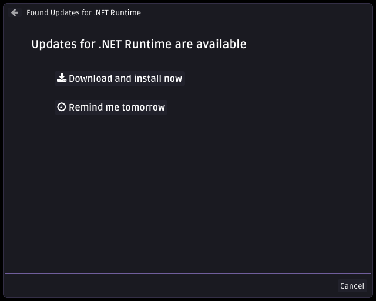
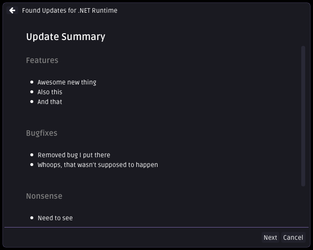

# Nefarius' vīcĭus updater agent

   <!--  -->

Nefarius' [nŏvīcĭus](https://latinitium.com/latin-dictionaries/?t=lsn31290) universal software updater agent for Windows.

## About

<!--
---

*Very* work in progress, do not use 🔥 Star ⭐ it instead to show interest 🤟

---
-->
vīcĭus is a self-contained C++20 executable acting as a software update agent. It can be deployed alongside your product and will take care of periodically checking for newer versions online and notifying the user of pending updates. Its goal is to require the least amount of configuration to get it up and running while providing enough flexibility to be customized for various environments, if desired. It doesn't require any prerequisites being present on the target system and should be able to run on any recent Windows version.

## Features

- **No backend application server required**  
  All you need on the server-side to get going is a web host supporting delivering static JSON files and you're done. [GitHub Pages](https://pages.github.com/) would be a sufficient free hosting solution where you can upload to and deliver the updater configuration from. Take a look at the [example server implementation](examples/server) if you wish to write your own backend service.
- **Self-contained**  
  No need to worry if .NET or other runtimes are present on the target machines, everything it needs is delivered in a single Win32 executable.
- **(Almost) zero configuration**  
  The bare minimum configuration can be provided by simply compiling in the server URL by adjusting the `CustomizeMe.h` header file. This does not mean you need to maintain one build for every product you wanna support; you will get **multi-tenancy out of the box** by simply naming the resulting executable after the following scheme: `manufacturer_product_Updater.exe`, e.g. `nefarius_HidHide_Updater.exe` will build the server path as `https://example.org/api/nefarius/HidHide/updates.json` (or however it is defined in `CustomizeMe.h`) automatically!
  - All alternative, more sophisticated configuration options [are described in the extended documentation](https://docs.nefarius.at/projects/Vicius/Server-Discovery/).
- **Self-updater**  
  Sometimes just the updater process needs an update (e.g. security patches), not the entire product it is watching over. It can update itself if the server-provided instance version is higher than the locally running one.
- **Self-healing**  
  If run in autostart when the user logs on, it can make sure that scheduled tasks and other supportive components are configured and working properly.
- **Low resource consumption**  
  The updater process is only invoked on demand (at user logon and once per day via Task Scheduler) and doesn't keep running in the background.
- **Respects your time**  
  Busy fragging in a game? We won't bother you with any popup windows until you're ready.

## Prerequisites

- Windows 7 or later (x86, x86_64, ARM64)
- An NTFS formatted volume
- An Internet connection

## Documentation

Head over to the [extended documentation](https://docs.nefarius.at/projects/Vicius/) for examples and detailed explanations.

## Downloads

You can get [unsigned build snapshots here](https://buildbot.nefarius.at/builds/vicius/). Consider these Beta-releases.

Signed stable releases will be provided [on the repository releases page](../../releases/).

## Screenshots

## TODOs

Non-exhaustive list of things open or in-progress...

### Must-haves

- [x] Implement "postpone" choice behaviour
- [ ] Handle all known error-cases (and retries)
  - [ ] Server response errors
  - [x] Release download errors
  - [ ] Setup launch errors
  - [ ] ...
- [ ] Finalize local updater config JSON format
- [ ] Add silent update option
- [ ] [Documentation](https://docs.nefarius.at/projects/Vicius/)
  - [ ] About page
  - [x] JSON Schemas
  - [x] Specify supported Command Line Arguments
  - [x] Exit Codes
  - [x] Emergency Feature
  - [x] Server Discovery
  - [x] Logging
  - [ ] Common Errors
  - [ ] Local Configuration
  - [x] Remote Configuration
  - [ ] ...
- [ ] Add message box dialog if the user launches the updater with no args
  - [x] Standard text if we are up to date
  - [ ] Inform if Betas are available
- [ ] Finalize UI design
  - [x] `WizardPage::Start`
  - [x] `WizardPage::SingleVersionSummary`
  - [ ] `WizardPage::MultipleVersionsOverview`
  - [x] `WizardPage::DownloadAndInstall`
  - [ ] ...
- [x] Implement Task Scheduler
  - [x] Registration
  - [x] Removal

### Nice-to-haves

- [ ] Design Beta-Release support
- [ ] Make app icon customizable
- [ ] Add "Light" theme
- [ ] Make UI DPI-aware
- [ ] Add embedded images support for Markdown widget
- [ ] Support closing and restarting applications before and after the main update
- [ ] Support running prerequisites installation before main update
- [ ] Support running the update [as Administrator](https://stackoverflow.com/a/4893508)
- [ ] Implement machine-wide registration  
      Currently only the user executing the updater will run registrations, which is sufficient for most cases
- [ ] Postpone update dialog popping up if the product is currently in use
- [ ] Add [Authenticode](https://learn.microsoft.com/en-us/windows-hardware/drivers/install/authenticode) signature checks
- [ ] Allow using a HTTP proxy address via configuration
- [ ] Support environment variables or custom placeholders in path strings and alike

### Done

- [x] Finalize REST API design
- [x] Add info dialog before self-updating UAC dialog comes up
- [x] Add self-updater logic
  - [x] Tests
  - [x] Fix issues launching from write-protected directory like `Program Files`
- [x] Implement Product Version detection
  - [x] `RegistryValue`
  - [x] `FileVersion`
  - [x] `FileSize`
  - [x] `FileChecksum`
- [x] Add some logging
- [x] Tidy up and improve includes
  - [x] Optimize build times
  - [x] Use pre-compiled headers?

## Sources & 3rd party credits

This tool benefits from these awesome projects ❤ (appearance in no special order):

### Dependencies

- [Dear ImGui](https://github.com/ocornut/imgui)
- [Simple and Fast Multimedia Library](https://www.sfml-dev.org/)
- [ImGui-SFML](https://github.com/SFML/imgui-sfml)
- [Argh! A minimalist argument handler](https://github.com/adishavit/argh)
- [Markdown for Dear ImGui](https://github.com/juliettef/imgui_markdown)
- [IconFontCppHeaders](https://github.com/juliettef/IconFontCppHeaders)
- [Ruda Font](https://fonts.google.com/specimen/Ruda)
- [Fork Awesome](https://forkaweso.me/Fork-Awesome/)
- [REST client for C++](https://github.com/mrtazz/restclient-cpp)
  - [libcurl](https://curl.se/libcurl/)
- [cURLpp](https://github.com/jpbarrette/curlpp)
- [JSON for Modern C++](https://github.com/nlohmann/json)
- [Magic Enum C++](https://github.com/Neargye/magic_enum)
- [Semantic Versioning for modern C++](https://github.com/Neargye/semver)
- [WinReg](https://github.com/GiovanniDicanio/WinReg)
- [Portable C++ Hashing Library](https://github.com/stbrumme/hash-library)
- [A modern C++ scope guard that is easy to use but hard to misuse](https://github.com/ricab/scope_guard)
- [Fast C++ logging library](https://github.com/gabime/spdlog)

### Literature & references

- [Using Icon Fonts](https://github.com/ocornut/imgui/blob/master/docs/FONTS.md#using-icon-fonts)
- [DailyTaskScheduler](https://github.com/JohnAliyetti/DailyTaskScheduler)
- [INFO: Windows Rundll and Rundll32 Interface](https://web.archive.org/web/20150109234931/http://support.microsoft.com/kb/164787)
- [How can I run a child process that requires elevation and wait?](https://stackoverflow.com/a/4893508)
- [Execute from Alternate Streams](https://gist.github.com/api0cradle/cdd2d0d0ec9abb686f0e89306e277b8f)
- [Vista Goodies in C++: Showing Friendly Messages with Task Dialogs](https://www.codeproject.com/articles/16753/vista-goodies-in-c-showing-friendly-messages-with)
