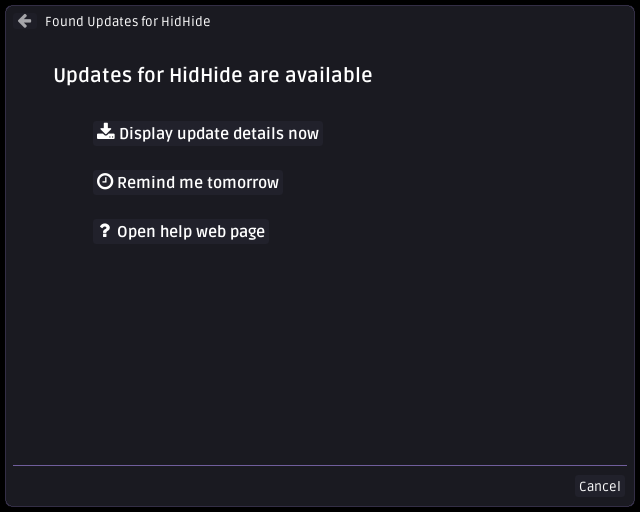
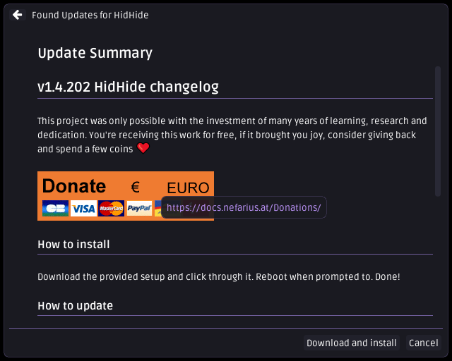
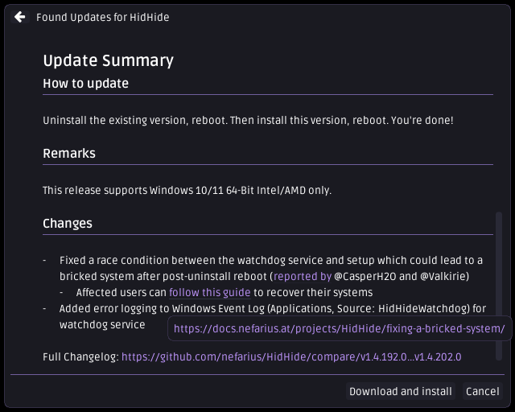
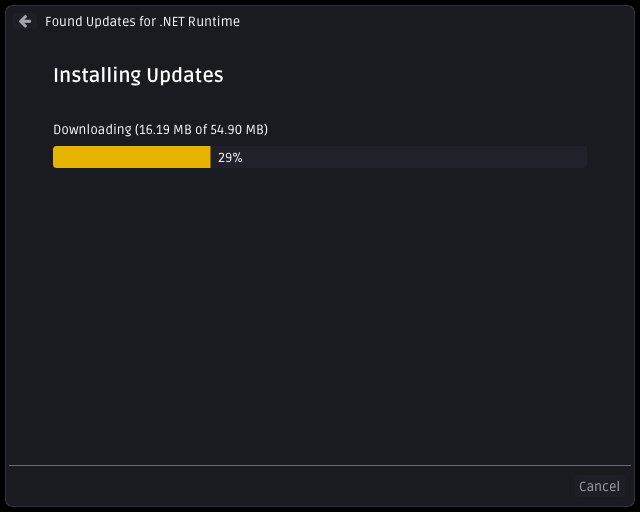
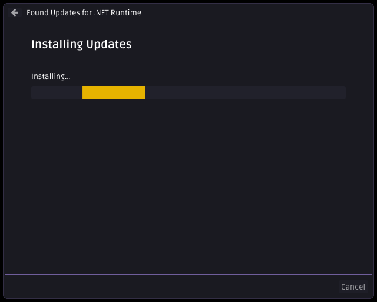

# Nefarius™ vīcĭus updater agent

[](https://ci.appveyor.com/project/nefarius/vicius)
[](https://docs.nefarius.at/projects/Vicius/)
[](../../releases/)
[](https://discord.nefarius.at/)
[](https://fosstodon.org/@Nefarius)

Nefarius' [nŏvīcĭus](https://latinitium.com/latin-dictionaries/?t=lsn31290) universal software updater agent for Windows.

## About

vīcĭus is a self-contained C++23 executable acting as a software update agent for Microsoft Windows. It can be deployed alongside your product and will take care of periodically checking for newer versions online and notifying the user of pending updates. Its goal is to require the least amount of configuration to get it up and running while providing enough flexibility to be customized for various environments, if desired. It doesn't require any prerequisites being present on the target system and should be able to run on any recent Windows version.

## Motivation

Dealing with software update mechanics has been a steady companion for almost 10 years by now, so it's about time to learn from all the mistakes, hardships and shortcomings the various products used have put me through all this time 😅 If you want something done right, you gotta do it yourself 💪

## Features

- **No backend application server required**<br/>
  All you need on the server-side to get going is a web host supporting delivering static JSON files and you're done. [GitHub Pages](https://pages.github.com/) would be a sufficient free hosting solution where you can upload to and deliver the updater configuration from. Take a look at the [example server implementation](examples/server) if you wish to write your own backend service.
- **Self-contained**<br/>
  No need to worry if .NET or other runtimes are present on the target machines, everything it needs is delivered in a single Win32 executable.
- **(Almost) zero configuration**<br/>
  The bare minimum configuration can be provided by simply compiling in the server URL by adjusting the `CustomizeMe.h` header file. This does not mean you need to maintain one build for every product you wanna support; you will get **multi-tenancy out of the box** by simply naming the resulting executable after the following scheme: `manufacturer_product_Updater.exe`, e.g. `nefarius_HidHide_Updater.exe` will build the server path as `https://example.org/api/nefarius/HidHide/updates.json` (or however it is defined in `CustomizeMe.h`) automatically!
  - All alternative, more sophisticated configuration options [are described in the extended documentation](https://docs.nefarius.at/projects/Vicius/Server-Discovery/).
  - If you wish to completely avoid touching the cloned sources [have a look at the optional includes](include/README.md).
- **Sane defaults**<br/>
  We hate wasting time writing configuration files as much as the next person; most configuration options are either optional or have sane default fallback values you can depend on.
- **Self-updater**<br/>
  Sometimes just the updater process needs an update (e.g. security patches), not the entire product it is watching over. It can update itself if the server-provided instance version is higher than the locally running one.
- **Self-healing**<br/>
  If run in autostart when the user logs on, it can make sure that scheduled tasks and other supportive components are configured and working properly.
- **Low resource consumption**<br/>
  The updater process is only invoked on demand (at user logon and once per day via Task Scheduler) and doesn't keep running in the background.
- **Respects your time**<br/>
  Busy fragging in a game? We won't bother you with any popup windows until you're ready.
- **Powerful template engine included**<br/>
  Sometimes finding the local resource of interest to check the product version can be more challenging than just having a static, boring file path. You can use [inja](https://github.com/pantor/inja) templates to build your own path resolving logic, all while never having to leave your JSON strings!
- **Expressive modern changelog support**<br/>
  Update summaries a.k.a. changelogs don't have to be boring slabs of text; [Markdown](https://www.markdownguide.org/) is fully supported! The included fonts are also capable of rendering [Fork Awesome icons](https://forkaweso.me/Fork-Awesome/) and [**system-provided emojis**](https://learn.microsoft.com/en-us/typography/font-list/segoe-ui-emoji)! 🎉 🥳 🍕

## Prerequisites

- Windows 7 or later (x86, x86_64, ARM64)
  - **Note:** currently anything below Windows 10 is untested and low priority
- An NTFS formatted volume
- An Internet connection
- Your software updates need to be packaged in one of the following ways:
  - Some sort of setup engine like [WiX](https://wixtoolset.org/)/[WixSharp](https://github.com/oleg-shilo/wixsharp), [Inno Setup](https://jrsoftware.org/isinfo.php), [Advanced Installer](https://www.advancedinstaller.com/), [NSIS](https://nsis.sourceforge.io/Download) or similar
  - A self-extracting archive ([7zip SFX](https://documentation.help/7-Zip/sfx.htm), [WinRAR SFX](https://documentation.help/WinRAR/HELPArcSFX.htm) and alike)
  - A ZIP archive containing portable software (see [this guide](https://docs.nefarius.at/projects/Vicius/ZIP-Archives/) for details)

## Documentation

Head over to the [extended documentation](https://docs.nefarius.at/projects/Vicius/) for examples and detailed explanations.

## Downloads

You can get [unsigned build snapshots here](https://buildbot.nefarius.at/builds/vicius/latest/bin/). Consider these Nightly-releases.

Signed stable releases will be provided [on the repository releases page](../../releases/). Keep in mind though that those releases are built to use my own update infrastructure so in 99% of the cases you probably don't want to use them, at least not without a configuration file!

## Screenshots











## How to build

Set up Visual Studio 2022 or newer with the C++ Desktop Development workload.

To get binary compression to work [upx](https://upx.github.io/) has to be installed. You can do so via e.g.:

```PowerShell
winget install upx
```

### Multi-tenant build example

You do not have to touch the checked out sources if you wish to customize your build.

Assuming a manufacturer name `Valkirie` and product name `HandheldCompanion`, create the following folder structure and file `.\include\Valkirie\HandheldCompanion\ViciusPostCustomizeMe.h` and override the server url in there like so:

```cpp
#undef NV_API_URL_TEMPLATE
#define NV_API_URL_TEMPLATE     "https://raw.githubusercontent.com/Valkirie/HandheldCompanion/main/Valkirie_HandheldCompanion_Updates.json"
```

Now you can build from the command line pointing the compiler to the directory of your header(s) like so:

```PowerShell
msbuild .\src\vīcĭus.vcxproj /p:Configuration=Release /p:CustomIncludes="${PWD}\include\Valkirie\HandheldCompanion\" /p:UpdaterName=Valkirie_HandheldCompanion_Updater
```

This will produce the binary `Valkirie_HandheldCompanion_Updater.exe` with the server URL of your custom header file baked into it!

You're of course free to put the custom header files anywhere on your system (like your own private repository), they do not need to be put under the project root directory.

## TODOs

For more details [check the issue tracker](../../issues).

Non-exhaustive list of things open or in-progress...

### Must-haves

- [ ] Add silent update option
  - [x] Docs
  - [x] Types
  - [ ] Implementation (see [#15](../../issues/15))
- [ ] Add message box dialog if the user launches the updater with no args
  - [x] Standard text if we are up to date
  - [ ] Inform if Betas are available

### Nice-to-haves

- [ ] Localization
- [ ] Add [Authenticode](https://learn.microsoft.com/en-us/windows-hardware/drivers/install/authenticode) signature checks (see [#7](../../issues/7))
  - [ ] Crypto primitives
  - [ ] Model types
  - [ ] Business logic
- [ ] Design Beta-Release support
  - [ ] `WizardPage::MultipleVersionsOverview`
- [ ] Make app icon customizable
- [ ] Add "Light" theme
- [ ] Support closing and restarting applications before and after the main update
- [ ] Support running prerequisites installation before main update
- [ ] Support running the update [as Administrator](https://stackoverflow.com/a/4893508)
- [ ] Implement machine-wide registration
      Currently only the user executing the updater will run registrations, which is sufficient for most cases
- [ ] Postpone update dialog popping up if the product is currently in use
- [ ] Allow using a HTTP proxy address via configuration
- [ ] Add SAL annotations

### Done

<details><summary>Expand me!</summary>

- [x] Make UI DPI-aware
- [x] Finalize UI design
  - [x] `WizardPage::Start`
  - [x] `WizardPage::SingleVersionSummary`
  - [x] `WizardPage::DownloadAndInstall`
- [x] Finalize local updater config JSON format
- [x] Add retry-logic (e.g. retry failed downloads etc.)
- [x] Add some fallback code if the temp directory isn't available
- [x] Handle all known error-cases
  - [x] Server response errors
  - [x] Release download errors
  - [x] Setup launch errors
- [x] [Documentation](https://docs.nefarius.at/projects/Vicius/)
  - [x] About page
  - [x] JSON Schemas
  - [x] Specify supported Command Line Arguments
  - [x] Exit Codes
  - [x] Emergency Feature
  - [x] Server Discovery
  - [x] Logging
  - [x] Common Errors
  - [x] Local Configuration
  - [x] Remote Configuration
- [x] Allow setting the download directory
- [x] Implement "postpone" choice behaviour
- [x] Implement Task Scheduler
  - [x] Registration
  - [x] Removal
- [x] Finalize REST API design
- [x] Add info dialog before self-updating UAC dialog comes up
- [x] Add self-updater logic
  - [x] Tests
  - [x] Fix issues launching from write-protected directory like `Program Files`
- [x] Implement Product Version detection
  - [x] `RegistryValue`
  - [x] `FileVersion`
  - [x] `FileSize`
  - [x] `FileChecksum`
  - [x] `CustomExpression`
- [x] Add some logging
- [x] Tidy up and improve includes
  - [x] Optimize build times
  - [x] Use pre-compiled headers?
- [x] Support environment variables or custom placeholders in path strings and alike

</details>

## Sponsors

[](https://www.jetbrains.com/resharper/)

## Sources & 3rd party credits

This tool benefits from these awesome projects ❤ (appearance in no special order):

### Dependencies

- [Dear ImGui](https://github.com/ocornut/imgui)
- [Simple and Fast Multimedia Library](https://www.sfml-dev.org/)
- [ImGui-SFML](https://github.com/SFML/imgui-sfml)
- [Argh! A minimalist argument handler](https://github.com/adishavit/argh)
- [Markdown renderer for Dear ImGui using MD4C parser](https://github.com/mekhontsev/imgui_md)
- [IconFontCppHeaders](https://github.com/juliettef/IconFontCppHeaders)
- [Ruda Font](https://fonts.google.com/specimen/Ruda)
- [Fork Awesome](https://forkaweso.me/Fork-Awesome/)
- [REST client for C++](https://github.com/mrtazz/restclient-cpp)
  - [libcurl](https://curl.se/libcurl/)
- [cURLpp](https://github.com/jpbarrette/curlpp)
- [JSON for Modern C++](https://github.com/nlohmann/json)
- [Magic Enum C++](https://github.com/Neargye/magic_enum)
- [Semantic Versioning library for modern C++](https://github.com/z4kn4fein/cpp-semver)
- [WinReg](https://github.com/GiovanniDicanio/WinReg)
- [Portable C++ Hashing Library](https://github.com/stbrumme/hash-library)
- [A modern C++ scope guard that is easy to use but hard to misuse](https://github.com/ricab/scope_guard)
- [Fast C++ logging library](https://github.com/gabime/spdlog)
- [A Template Engine for Modern C++](https://github.com/pantor/inja)
- [Simple C++ ini parser](https://github.com/mcmtroffaes/inipp)
- [MimeTypes](https://github.com/lasselukkari/MimeTypes)
- [A C++ header-only HTTP/HTTPS server and client library](https://github.com/yhirose/cpp-httplib)
- [A C library for reading, creating, and modifying zip archives](https://github.com/nih-at/libzip)
- [My opinionated collection of C++ utilities](https://github.com/nefarius/neflib)

### Literature & references

- [Using Icon Fonts](https://github.com/ocornut/imgui/blob/master/docs/FONTS.md#using-icon-fonts)
  - [imgui_freetype](https://github.com/ocornut/imgui/blob/master/misc/freetype/README.md)
  - [Using Colorful Glyphs/Emojis](https://github.com/ocornut/imgui/blob/master/docs/FONTS.md#using-colorful-glyphsemojis)
- [Image Loading and Displaying Examples](https://github.com/ocornut/imgui/wiki/Image-Loading-and-Displaying-Examples)
- [DailyTaskScheduler](https://github.com/JohnAliyetti/DailyTaskScheduler)
- [INFO: Windows Rundll and Rundll32 Interface](https://web.archive.org/web/20150109234931/http://support.microsoft.com/kb/164787)
- [How can I run a child process that requires elevation and wait?](https://stackoverflow.com/a/4893508)
- [Execute from Alternate Streams](https://gist.github.com/api0cradle/cdd2d0d0ec9abb686f0e89306e277b8f)
- [Vista Goodies in C++: Showing Friendly Messages with Task Dialogs](https://www.codeproject.com/articles/16753/vista-goodies-in-c-showing-friendly-messages-with)
- [How to retrieve files digital signature information?](https://stackoverflow.com/a/15030232)
- [Windows Authenticode Portable Executable Signature Format](http://download.microsoft.com/download/9/c/5/9c5b2167-8017-4bae-9fde-d599bac8184a/authenticode_pe.docx)
- [How To Get Information from Authenticode Signed Executables](https://gist.github.com/dougpuob/1cb6c2f16c95d1e7f324d23e76c80f8e)
- [VERSIONINFO resource](https://learn.microsoft.com/en-us/windows/win32/menurc/versioninfo-resource)
- [Semantic Versioning 2.0.0](https://semver.org/)
- [Windows Platform Comparison Environment Variable Reference](http://web.archive.org/web/20120101144026/http://www.scriptlogic.com/support/CustomScripts/environmentVariableReference.html)
- [C++ Library Manager for Windows, Linux, and MacOS](https://github.com/microsoft/vcpkg)
- [Silently Install EXE and MSI setup applications (Unattended) - How To Guide](https://www.advancedinstaller.com/silent-install-exe-msi-applications.html)
- [Markdown Guide Basic Syntax](https://markdownguide.offshoot.io/basic-syntax/)

#### DPI-awareness

- [Writing Win32 apps like it's 2020: A DPI-aware resizable wizard](https://building.enlyze.com/posts/writing-win32-apps-like-its-2020-part-3/)
- [imgui-sfml / DPI-awareness on Windows](https://github.com/SFML/imgui-sfml/issues/284#issuecomment-2188557821)
- [Examples: A very simple example of High DPI changing handling for Win32](https://github.com/ocornut/imgui/discussions/3925)
- [imgui / Blurry fonts in high DPI](https://github.com/ocornut/imgui/issues/1065)
- [thedmd/imgui/tree/feature/hidpi-support](https://github.com/ocornut/imgui/compare/master...thedmd:imgui:feature/hidpi-support)
